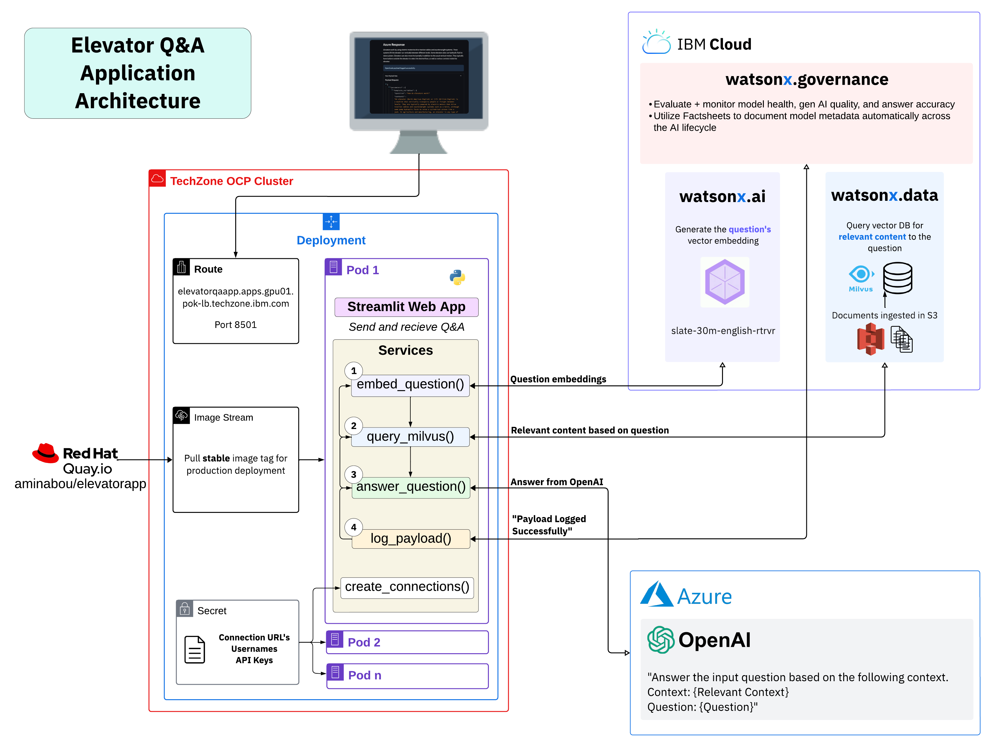

# Elevator Q&A App

## Overview

The **Elevator Q&A App** is a Streamlit-based interactive web app designed to answer questions about elevators while highlighting the integration of OpenAI GPT models with Watsonx.governance. The application leverages various IBM and third-party services, including **Azure OpenAI** (GPT-3.5-Turbo), **IBM Watsonx.ai**, and **IBM Watsonx.governance**, along with the **Milvus vector database** to provide accurate responses based on embedded queries. The app allows users to input elevator-related questions and receive context-based answers, while also logging all interactions for monitoring purposes using IBM Watson OpenScale.

## How It Works

1. **User Inputs Question** - anything related to elevators.
2. **Query Embeddings** - query the Milvus database for relevant context (elevator-related articles) using the input question.
3. **Answer Generation** - the context retrieved from Milvus is sent to Azure OpenAI, which generates a response using GPT-3.5-Turbo.
4. **Payload Logging** - Payload data containing the input/output is logged asynchronously in IBM Watson OpenScale for AI model monitoring and evaluations.

## Architecture


## Key Components

1. **Milvus Vector Database**:
    - Stores and searches vectorized data about elevators, creating the knowledge base for the Q&A App.
    - When a query is made, embeddings of the query are matched with stored embeddings to retrieve relevant articles about elevators.

2. **IBM Watsonx.ai**:
    - Embed the user’s inputted question with the `sentence-transformers/all-minilm-l12-v2` model.
    - Embeddings are used to retrieve relevant context from Milvus to provide accurate, context-aware responses.

3. **Azure OpenAI**:
    - The GPT-3.5-Turbo model is utilized for generating responses.
    - The prompt template used to call the model is grounded with the relevant context and inputted question to retreive an output

4. **IBM Watsonx.governance**:
    - Leverage IBM Watson OpenScale for monitoring, logging, and governance of AI model health and answer quality.
    - Track the OpenAI GPT 3.5-turbo model's development lifeycle.

## Project Structure

- **`services.py`**: Service classes for connecting to and calling the key components:
    - **AzureOpenAIService**: Manages Azure OpenAI client connection and generates responses using GPT 3.5-turbo LLM.
    - **WatsonXAIService**: Embeds queries using IBM Watsonx.ai.
    - **MilvusService**: Connects to and interacts with Milvus to search for context.
    - **`get_answer_with_context`**: Combines relevant context and input question to generate a response to user queries.
    - **`log_payload`**: Logs payload data into IBM Watson OpenScale.

- **`app.py`**: The main Streamlit app defining the user interface. Includes:
    - Input user's Azure OpenAI credentials.
    - A text box for asking elevator-related questions and displaying responses.
    - Log payload data to Watson OpenScale and analyze the request & response JSON body being sent.

- **`.env`**: Stores environment variables for API keys, URLs, and project IDs, including:

## How to Run Locally

1. Clone the repository:
   ```bash
   git clone https://github.ibm.com/aminabou/elevatorapp.git
   cd elevatorapp
2. Install the Required Dependencies
    ```bash
    pip install -r requirements.txt
3. Set Up the Environment Variables in **config.env**
4. Run the app!
    ```bash
    streamlit run app.py
